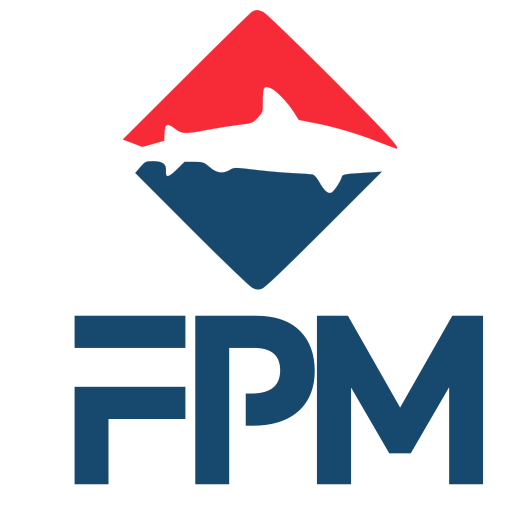

<a name="readme-top"></a>

[![Contributors][contributors-shield]][contributors-url]
[![Forks][forks-shield]][forks-url]
[![Stargazers][stars-shield]][stars-url]
[![Issues][issues-shield]][issues-url]
[![AGPL v3 License][license-shield]][license-url]

<br />
<div align="center">
  <a href="https://github.com/IT-Hock/fpm">
    
  </a>

<h3 align="center">Fish Package Manager</h3>

  <p align="center">
    The fish package manager allows you to easily install and manage fish extensions and themes.
    <br />
    <a href="https://github.com/IT-Hock/fpm"><strong>Explore the docs »</strong></a>
    <br />
    <br />
    <a href="https://github.com/IT-Hock/fpm">View Demo</a>
    ·
    <a href="https://github.com/IT-Hock/fpm/issues">Report Bug</a>
    ·
    <a href="https://github.com/IT-Hock/fpm/issues">Request Feature</a>
  </p>
</div>

<details>
  <summary>Table of Contents</summary>
  <ol>
    <li>
      <a href="#about-the-project">About The Project</a>
      <ul>
        <li><a href="#built-with">Built With</a></li>
      </ul>
    </li>
    <li>
      <a href="#getting-started">Getting Started</a>
      <ul>
        <li><a href="#installation">Installation</a></li>
      </ul>
    </li>
    <li><a href="#contributing">Contributing</a></li>
    <li><a href="#license">License</a></li>
  </ol>
</details>


<!-- ABOUT THE PROJECT -->
## About The Project

[![FPM Screen Shot][product-screenshot]](https://example.com)

The fish package manager was born out of frustration over other "package managers" for the fish shell.
A main goal was to have a package manager that's as easy and intuitive as others,
like npm, pip, or cargo. The other goal was to have a package registry where you can search and display
packages using your web browser.

<p align="right">(<a href="#readme-top">back to top</a>)</p>

### Built With

* [![Golang][Golang]][Golang-url]
* [![Goland][Goland]][Goland-url]
* [![Bootstrap][Bootstrap.com]][Bootstrap-url]
* [![JQuery][JQuery.com]][JQuery-url]

<p align="right">(<a href="#readme-top">back to top</a>)</p>

## Getting Started

To get a local copy up and running follow these steps.
In the future the repository contains a single fish script that you can download using curl
and run directly.

### Installation

1. Download the latest release from the [releases page](https://github.com/IT-Hock/fpm/releases)
2. Extract the archive in a sensible directory. Recommended is `~/.local/share/fpm`
3. Add the directory to your `PATH` environment variable. For example using your `~/.config/fish/config.fish`:
   ```fish
   fish_add_path ~/.local/share/fpm
   ```
4. It's recommended to login to github using the `fpm github login` command. This is to prevent rate limiting.
   You can also use a personal access token to login.<br/>
   <b>NOTE: The subcommand login is only available in this' repository release builds as only those contain a github client id and secret.</b><br/>
   See `fpm github login --help` for more information.

FPM is now installed and ready to use.
You can install packages using the `fpm install` command.
By default after running FPM once it will create some scripts to make it easier to use.
For example a completion file will be created to enable tab completion for the `fpm` command.

<p align="right">(<a href="#readme-top">back to top</a>)</p>

## Contributing

Contributions are what make the open source community such an amazing place to learn, inspire, and create. Any contributions you make are **greatly appreciated**.

If you have a suggestion that would make this better, please fork the repo and create a pull request. You can also simply open an issue with the tag "enhancement".
Don't forget to give the project a star! Thanks again!

1. Fork the Project
2. Create your Feature Branch (`git checkout -b feature/AmazingFeature`)
3. Commit your Changes (`git commit -m 'Add some AmazingFeature'`)
4. Push to the Branch (`git push origin feature/AmazingFeature`)
5. Open a Pull Request

<p align="right">(<a href="#readme-top">back to top</a>)</p>

## License

Distributed under the AGPL-3.0 License. See `LICENSE` for more information.

<p align="right">(<a href="#readme-top">back to top</a>)</p>


<p align="right">(<a href="#readme-top">back to top</a>)</p>

<p align="right">(<a href="#readme-top">back to top</a>)</p>

[contributors-shield]: https://img.shields.io/github/contributors/IT-Hock/fpm.svg?style=for-the-badge
[contributors-url]: https://github.com/IT-Hock/fpm/graphs/contributors
[forks-shield]: https://img.shields.io/github/forks/IT-Hock/fpm.svg?style=for-the-badge
[forks-url]: https://github.com/IT-Hock/fpm/network/members
[stars-shield]: https://img.shields.io/github/stars/IT-Hock/fpm.svg?style=for-the-badge
[stars-url]: https://github.com/IT-Hock/fpm/stargazers
[issues-shield]: https://img.shields.io/github/issues/IT-Hock/fpm.svg?style=for-the-badge
[issues-url]: https://github.com/IT-Hock/fpm/issues
[license-shield]: https://img.shields.io/github/license/IT-Hock/fpm.svg?style=for-the-badge
[license-url]: https://github.com/IT-Hock/fpm/blob/master/LICENSE.txt
[linkedin-shield]: https://img.shields.io/badge/-LinkedIn-black.svg?style=for-the-badge&logo=linkedin&colorB=555
[linkedin-url]: https://linkedin.com/in/linkedin_username
[product-screenshot]: images/preview.svg
[Bootstrap.com]: https://img.shields.io/badge/Bootstrap-563D7C?style=for-the-badge&logo=bootstrap&logoColor=white
[Bootstrap-url]: https://getbootstrap.com
[JQuery.com]: https://img.shields.io/badge/jQuery-0769AD?style=for-the-badge&logo=jquery&logoColor=white
[JQuery-url]: https://jquery.com 
[Golang]: https://img.shields.io/badge/Go-00ADD8?style=for-the-badge&logo=go&logoColor=white
[Golang-url]: https://golang.org/
[Goland]: https://img.shields.io/badge/GoLand-000000?style=for-the-badge&logo=goland&logoColor=white
[Goland-url]: https://www.jetbrains.com/go/